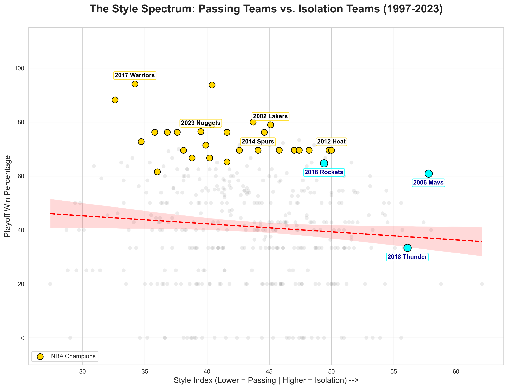

# NBA Isolation Paradox

### Project Overview
Does "Hero Ball" actually lose games? This project uses data science to challenge the basketball narrative that isolation-heavy offenses are unsustainable in the playoffs. By analyzing 27 years of NBA advanced stats, I measured the relationship between offensive style and winning. 

### The Experiment
**Hypothesis:** Isolation-heavy teams will have a lower playoff win percentage than high-passing teams.

**The Math:**
- **Style Index:** Calculated as `(1 - Assist %) * 100`. 
  - *Lower Score:* Passing-oriented (e.g., 2014 Spurs)
  - *Higher Score:* Isolation-oriented (e.g., 2018 Rockets)
- **Metrics:** Pearson Correlation Coefficient ($r$) and P-Value ($p$).

### The Visualization

#### **How to Read this Chart:**
* **The Red Dashed Line (Linear Regression):** This is the "average" trend. It shows that as teams move toward more Isolation, the win percentage drops slightly. 
* **The Pink Shaded Area (95% Confidence Interval):** This represents the statistical "Margin of Error." 
  - **Data Science Note:** Because this area is wide and most teams (gray dots) sit far away from it, it proves that **Style Index** is a weak predictor of winning. There is too much variety for the red line to be a "rule."
* **Gold Dots:** NBA Champions.
* **Cyan Dots:** Notable high-isolation teams (Rockets, Thunder, Mavs).

### Results & Final Conclusion

#### **The Findings**
* **The Correlation is Weak:** The correlation coefficient ($r$) is **-0.0935**, indicating almost no linear relationship between offensive style and winning percentage. 
* **Statistically Insignificant:** A P-value of **0.0558** suggests that the slight downward trend observed is not strong enough to be considered a "rule." In data science, this means we cannot definitively say that isolation causes losing; the trend could likely be due to random chance.
* **The Paradox:** While the "average" high-isolation team tends to struggle, elite outliers like the **2018 Rockets** and **2012 Heat** prove that isolation is a championship-level strategy when executed by elite talent. These teams "defied the gravity" of the statistical average.

#### **Final Verdict**
**Winning in the NBA Playoffs is "Style Agnostic."** Whether a team utilizes the "Beautiful Game" passing of the 2014 Spurs or the "Mismatch Hunting" isolation of the 2018 Rockets, success is determined by **efficiency and talent**, not the frequency of passes. In the post-season, how well you execute your chosen system is significantly more important than which system you choose.

### File Structure
- `nba_stats.py`: Python script for data processing and visualization.
- `data/team_stats_advanced_po.csv`: Raw dataset (1997-2023).
- `NBA_style_comparison.png`: Final analysis visualization.

### Tools Used
- **Python** (Pandas, Scipy)
- **Visualization** (Matplotlib, Seaborn)